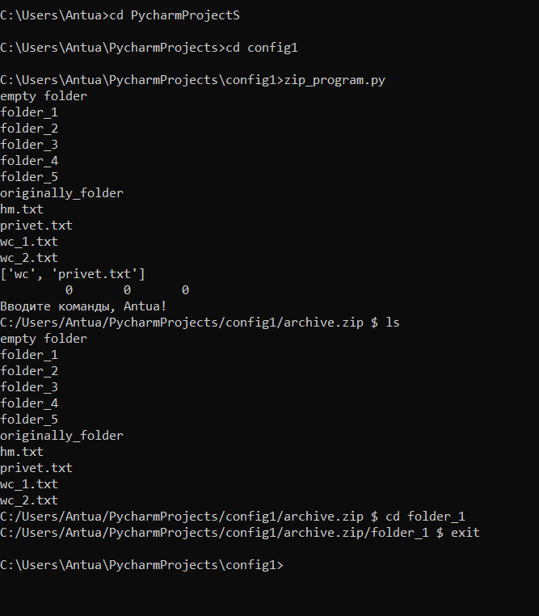
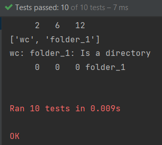

### Общее описание работы
Требуется разработать эмулятор для языка оболочки ОС, поддерживающий следующие команды:
1. ls - вывод каталогов и файлов для текущего каталога
2. cd - сменить директорию
3. exit - выход
4. touch - создать пустой текстовый файл
5. wc - проанализировать текстовый файл

Эмулятор должен работать в режиме CLI. Конфигурационный файл имеет формат расширения ini 

### Используемые модули и язык программирования
Использую язык программирования Python версии 10. Распаковка архива не проводилась.
В качестве модулей использую:
1. os - для работы со системой, включения автоскрипта.
2. zipfile - для работы над самим архивом.
3. configparser - для работы над файлом расширения .ini.
4. unitest - для тестирования программы.

### Описание команд, функционирование программы
Был создан достаточно объёмный архив, включающий в себя картинки, текстовые файлы и папки.
Для каждой требуемой команды (не считая exit) использована своя функция. В зависимости от действий пользователя в бесконечном цикле while будет вызвана соответствующая команда.
Отдельно выделю команду touch - в связи с тем, что архив поддерживает "файлов-дубликатов", не удалось найти способ для смены даты взаимодействия с файлом (при любой записи создаётся файл-дубликат).
Команда cd поддерживает абсолютный путь.
Я постарался имитировать оболочку, добавив в том числе реакцию на разного рода исключения.
Пример запуска программы из консоли:

### Тесты
В папке "tests" хранится файл с расширением .py, содержащий в себе тестирования всех функций.
Все они пройдены успешно.

### Url репозитория.
Домашнее задание размещено на гитхабе, ниже приложена ссылка на репозиторий:
https://github.com/Anton-Su/config_1
