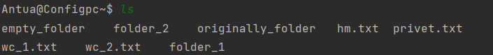
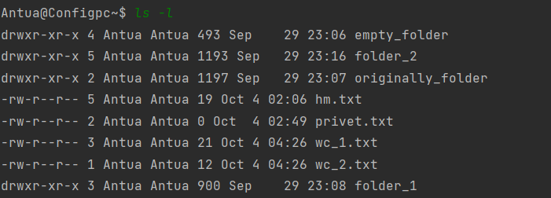
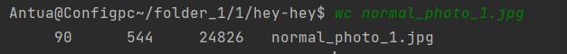
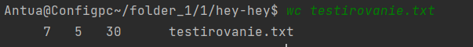
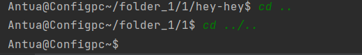

### Общее описание работы
Требуется разработать эмулятор для языка оболочки ОС, поддерживающий следующие команды:
1. ls - вывод каталогов и файлов для текущего каталога
2. cd - сменить директорию
3. exit - выход
4. touch - создать пустой текстовый файл (или перезаписать дату изменения)
5. wc - проанализировать текстовый файл

Эмулятор должен работать в режиме CLI. Конфигурационный файл имеет формат расширения ini 

### Используемые модули и язык программирования
Использую язык программирования Python версии 3.10 
Распаковка архива во время выполнения программы не проводилась.
В качестве модулей, импортируемых в программу, использую:
1. os - для работы с путями.
2. zipfile - для работы над самим архивом.
3. configparser - для считывания данных с файлом расширения .ini.
4. unitest - для тестирования программы.
5. random.randint - для имитации параметров, недоступных для считывания, вроде количества "ссылок".
6. datetime.datetime - для записи текущего времени.
7. re - для работы с регулярными выражениями.
8. sys - для взаимодействия c аргументами из командной строки

### Описание команд, функционирование программы
Был создан архив, имитирующий файловую систему, включающую в себя картинки, текстовые файлы и папки.
В бесконечном цикле, прерываемой командой "exit", обрабатывается ввод пользователя.
Если ввод пользователя может быть интерпретирован как одна из пяти команд, происходит её обработка.
Все команды, кроме ls и ls -l (из-за touch пришлось добавить опцию) принимают в себя один аргумент - путь (абсолютный или относительный).

Принадлежность к абсолютному пути сигнализирует первый символ "/".

До запуска основной программы запускается скрипт из команд, записанных в startscript.py.

Пробежимся по каждой команде, которую может использовать пользователь:
1. ls - выводит список файлов и директорий выбранного каталога через табуляцию. Пример операции: 
2. ls -l - выводит список файлов выбранного каталога в расширенном режиме. Пример операции: 
3. exit - завершение работы программы
4. touch [path]- создать файл/изменить дату изменения файла с выбранным путём. Результат операции можно увидеть при вызове команды ls (для первого случая достаточно обычного)
5. wc [path]- прочитать информацию (текстовый файл или изображение). Пример (изображение): Пример (текстовый файл) 
6. cd [path]- меняет директорию 

Все функции также обрабатывают случаи, когда запрос не был выполнен, и с целью максимальной схожести выводят соответствующие сообщения о невыполнения операции, и причину.
### Тесты
В папке "tests" хранится файл с расширением .py, содержащий в себе модуль тестирования всех функций, которых можно протестировать. На каждую функцию представлено три теста.

Все они пройдены успешно.
### Url репозитория.
Домашнее задание размещено на гитхабе, ссылка на репозиторий:
https://github.com/Anton-Su/config_1
